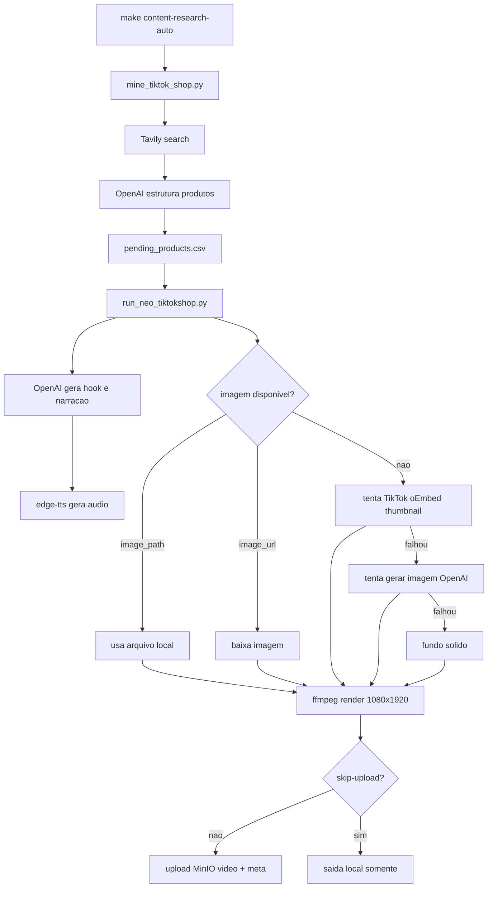

# Content Engine TikTok Shop - Guia Operacional

Este documento define o fluxo real do modulo `../neo-content-engine` sem ambiguidade de execucao.

Versao curta para operacao diaria:

- `docs/PIPELINE_NEO_TIKTOKSHOP_RUNBOOK.md`

## 1. O que o modulo faz

O modulo executa este ciclo:

1. Pesquisa oportunidades com Tavily.
2. Estrutura produtos em CSV.
3. Gera roteiro curto (hook + narracao) com OpenAI.
4. Gera audio com `edge-tts`.
5. Resolve imagem do video.
6. Renderiza MP4 vertical.
7. Publica no MinIO (opcional).

## 2. O que o modulo nao faz

- Nao consulta API oficial do TikTok Shop para catalogo interno de seller.
- Nao faz push para GitHub por padrao.
- Nao depende de geracao de imagem por IA para funcionar.

Observacao critica:

- A imagem do video vem primeiro de `image_url`/`image_path`.
- Se `image_url` vier vazio, o miner tenta thumbnail via TikTok `oEmbed`.
- So depois tenta geracao de imagem OpenAI.
- Se nada funcionar, cai em fundo solido escuro.

## 3. Estrutura de arquivos

- Miner: `../neo-content-engine/scripts/mine_tiktok_shop.py`
- Runner: `../neo-content-engine/scripts/run_neo_tiktokshop.py`
- Dependencias Python: `../neo-content-engine/requirements.txt`
- Runtime:
  - Entrada CSV: `../neo-content-engine/runtime/inputs/pending_products.csv`
  - Audio: `../neo-content-engine/runtime/assets/*_audio.mp3`
  - Video: `../neo-content-engine/runtime/outputs/*_final_render.mp4`
  - Metadata: `../neo-content-engine/runtime/outputs/*_meta.json`
  - CSV processado: `../neo-content-engine/runtime/inputs/archive/processed_<timestamp>.csv`

## 4. Variaveis de ambiente

Obrigatorias para fluxo completo:

- `TAVILY_API_KEY`
- `OPENAI_API_KEY`

Obrigatorias para upload:

- `MINIO_ENDPOINT`
- `MINIO_ROOT_USER`
- `MINIO_ROOT_PASSWORD`
- `MINIO_BUCKET`
- `MINIO_PUBLIC_BASE_URL`

Controle de custo:

- `NEO_MINE_LIMIT_PRODUCTS` (recomendado `1` ou `2` em teste)
- `NEO_RUN_MAX_PRODUCTS` (recomendado `1` ou `2` em teste)

Controle de imagem:

- `NEO_GENERATE_IMAGE_IF_MISSING=1|0`
- `OPENAI_IMAGE_MODEL` (padrao `gpt-image-1`)
- `NEO_IMAGE_SIZE` (padrao `1024x1536`)
- `NEO_IMAGE_QUALITY` (padrao `low`)

## 5. Modos de execucao

### A) Fluxo completo automatizado

```bash
make content-setup
NEO_MINE_LIMIT_PRODUCTS=2 NEO_RUN_MAX_PRODUCTS=2 make content-research-auto
```

Executa `mine -> minio-up -> minio-bucket -> run`.

### B) Producao a partir de CSV manual

1. Preencha `../neo-content-engine/runtime/inputs/pending_products.csv`.
2. Rode:

```bash
NEO_RUN_MAX_PRODUCTS=2 make content-auto
```

### C) Teste local fechado (sem upload)

```bash
NEO_RUN_MAX_PRODUCTS=1 \
../neo-content-engine/.venv/bin/python ../neo-content-engine/scripts/run_neo_tiktokshop.py --skip-upload
```

## 6. Formato de CSV

Campos esperados:

- `id`
- `name`
- `problem`
- `offer`
- `image_url` (opcional)
- `image_path` (opcional)

Exemplo minimo:

```csv
id,name,problem,offer,image_url,image_path
TX001,Seladora Portatil,Alimentos perdem frescor,Comissao alta,,
TX002,Escova 5 em 1,Finalizacao demora,Comissao media,https://dominio/produto.jpg,
```

## 7. Diagrama do fluxo



## 8. Como ler o resultado

Cada produto retorna JSON com campos de diagnostico.

Campos chave:

- `llm_status`: origem do roteiro.
  - `openai_ok:<modelo>`
  - `fallback_no_openai`
  - `fallback_openai_error:<erro>`
- `visual_source`: origem da imagem/fundo.
  - `product_image_path`
  - `product_image_url`
  - `product_image_generated_cached`
  - `image_gen_openai_ok:<modelo>`
  - `fallback_background:<motivo>`

Se `visual_source` vier com `fallback_background:image_gen_openai_error:PermissionDeniedError`, a chave OpenAI nao tem acesso ao modelo de imagem configurado.

## 9. Troubleshooting por sintoma

### Sintoma: video sai sem imagem de produto

Causa provavel:

- `image_url` vazio e `oEmbed` sem thumbnail valido.

Acao:

1. Preencher `image_url` manual no CSV para os itens criticos.
2. Ou fornecer `image_path` local.
3. Ou habilitar modelo de imagem no projeto OpenAI.

### Sintoma: erro de Tavily

Causa provavel:

- `TAVILY_API_KEY` ausente/invalida.

Acao:

1. Corrigir `.env`.
2. Rodar `make content-mine`.

### Sintoma: erro MinIO

Causa provavel:

- container parado ou credencial divergente.

Acao:

1. `make minio-up`
2. `make minio-bucket`
3. `make content-auto`

## 10. Commit no repositorio soberano

Fluxo recomendado:

```bash
cd ../neo-content-engine
git status
git add .
git commit -m "content-engine: ajuste de fluxo"
```

Push remoto quando desejar:

```bash
cd ../neo-content-engine
git push
```

## 11. Sequencia recomendada para teste economico

```bash
make content-setup
NEO_MINE_LIMIT_PRODUCTS=1 NEO_RUN_MAX_PRODUCTS=1 make content-research-auto
```

Alvo de sucesso:

- 1 CSV gerado
- 1 MP4 em `../neo-content-engine/runtime/outputs`
- `visual_source` diferente de fallback quando houver imagem valida
- upload MinIO apenas quando desejado
